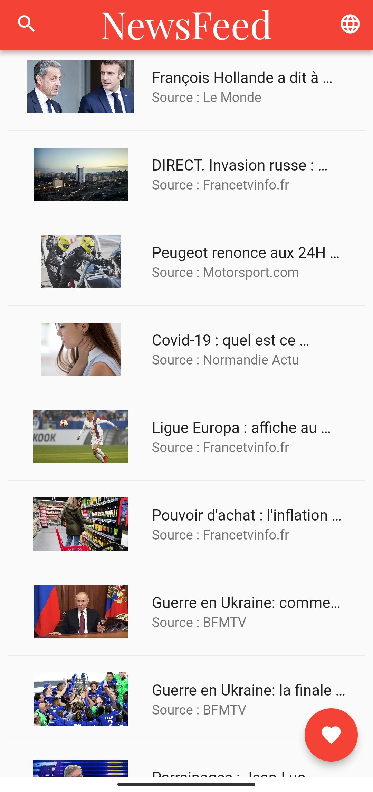
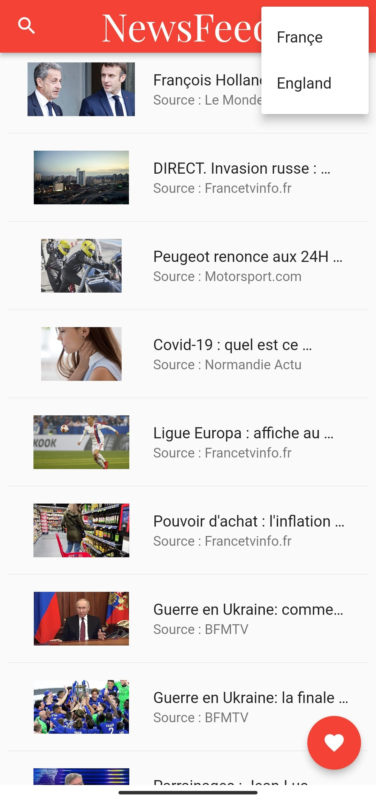
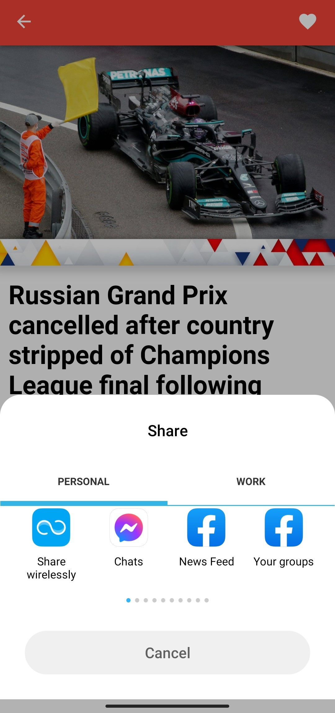
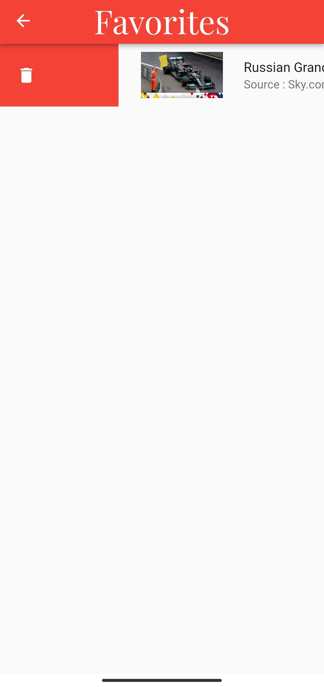
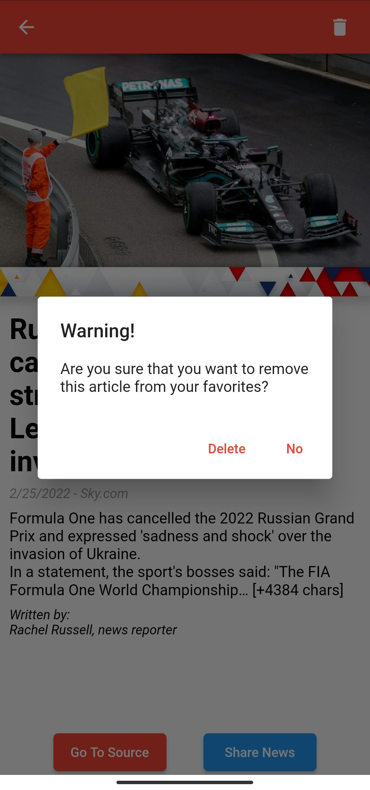

# appsolute_flutter_assignement

Hello!

This is a Flutter app that uses the NEWSapi to display top 20 articles by country, save articles on your device, search for articles using keywords and save articles locally.

# Demo

## Homepage

We can see in the homepage the top 20 headlines in france  We can  [Change the country](##Change-the-country) by clicking on the globe on the top right, [Check the saved articles](##Check-the-saved-articles) by tapping on the floating button, or [Search for an article using keywords](##Search-for-an-article-using-keywords). 

## Change the country

We get a list of the available countries, <em>for this demo's purpose i have set two countries</em>, by choosing england on the drop down menu the list refreshes and shows us the top headlines in the UK

now that the country is changed we shall select an article from the list to display its details.

We can now read the full article, [save it to our device](##Save-to-device), [share it](##Share-article) or [visit the source](##Visit-source)

## Save to device

by tapping the heart button on the top right of the screen we can save the current article to our device and there is a snackbar at the bottom to confirm it we can tap the <b>Undo</b> button on the snack bar to revert this action.

If we tap he heart button again we are welcomed with yet another snackbar saying that the article is already saved so we don't save duplicates

As you can see the newly added car is being shown in the home screen let's take a better look at it

## Share article

## Visit source

## Check the saved articles

By tapping the floating button on the home screen we get redirected to the saved articles screen or favorites screen.

We can see the article that we saved earlier present in there we can show the details, share it with others, go to the source or even remove it from our list.

In order to remove it we can either swipe it left to right 

or access the details

and use the delete button to do so

### Search for an article using keywords

By tapping the research button (loop) on the top lef of the screen we get access to the search screen.

after typng we can either use the loop button to search or our keyboard confirmation button.

We can scroll down the list of articles, show full details of the articles and sae them

### Infinite Scroll Pagination Demo Video

For the infinite scroll pagination on the search screen please watch this demo video  

## Thank you for your time